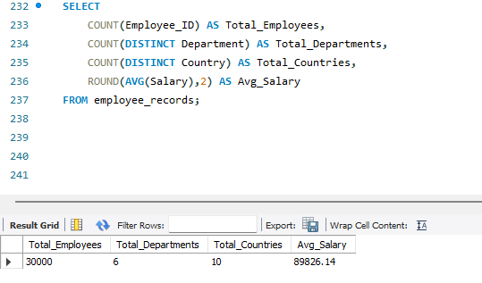
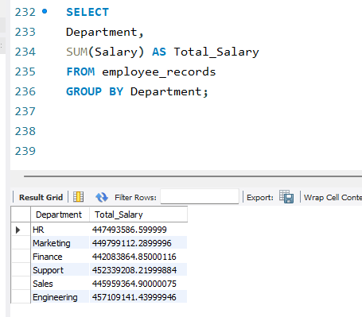
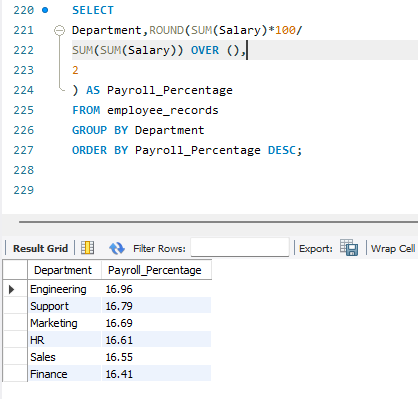
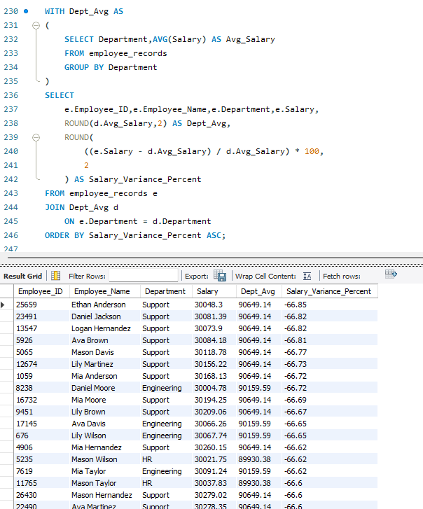
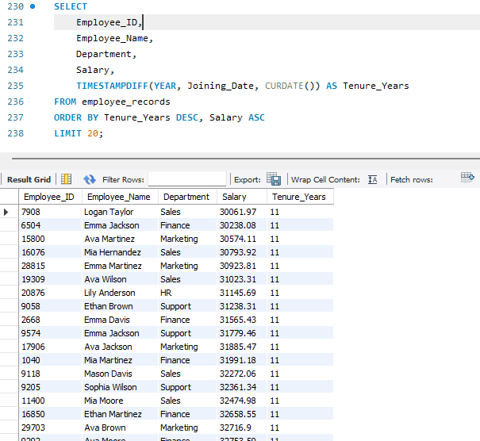

# Fintech-HR-Analytics-SQL-Project
HR Analytics &amp; Workforce Intelligence Project using SQL | EDA | Window Functions | CTEs | Salary Analysis | Business Insights

## Overview

This project analyzes HR workforce data using SQL to identify payroll trends, workforce distribution, salary variance, and employee retention risks.

The objective is to help HR teams make data-driven decisions regarding compensation planning, workforce management, and employee retention.

### Dataset

* Employee Records Dataset
* Total Employees: XXXX
* Departments: XXXX
* Metrics Analyzed:

  * Payroll Cost
  * Salary Variance
  * Workforce Distribution
  * Retention Risk

The project demonstrates practical SQL skills including:

* Data Exploration (EDA)
* Aggregate Functions
* CASE Statements
* Subqueries
* Common Table Expressions (CTEs)
* Window Functions
* Business Insight Generation

---
## Business Questions

1. Which department has the highest payroll expense?

2. Which employees earn significantly above or below department averages?

3. Which departments have the largest workforce?

4. Which employees are at retention risk?

5. What is the overall workforce distribution across departments?

6. Which department contributes most to total salary expenditure?

## Dataset Information

The dataset contains employee information including:

| Column        |
| ------------- |
| Employee_ID   |
| Employee_Name |
| Age           |
| Country       |
| Department    |
| Position      |
| Salary        |
| Joining_Date  |

---

## SQL Concepts Used

### Basic SQL

* SELECT
* WHERE
* ORDER BY
* GROUP BY

### Aggregate Functions

* COUNT()
* SUM()
* AVG()
* MIN()
* MAX()

### Advanced SQL

* CASE WHEN
* Subqueries
* CTEs
* ROW_NUMBER()
* RANK()
* DENSE_RANK()
* Window Functions

---

## Business Questions Solved

### Workforce Overview

* Total Employees
* Total Departments
* Total Countries

### Salary Analysis

* Department Wise Payroll Cost
* Average Salary by Department
* Salary Band Classification

### Hiring Analysis

* Employee Hiring Trends

### Compensation Analysis

* Employees Above Company Average Salary
* Department Salary Variance

### Retention Risk Analysis

* High Tenure Low Salary Employees
* Compensation Inequality Detection

---

## Key Insights

* Support department shows significant negative salary variance.
* Multiple employees earn substantially below departmental averages.
* Certain departments contribute disproportionately to payroll expenses.
* Long-tenured employees may be at higher retention risk due to lower compensation.

---

# Fintech HR Analytics SQL Project

## Project Screenshots

### Workforce Summary

### Department Payroll

### Department Payroll Analysis

### Salary Variance Analysis

### Retention Risk Analysis

## Technologies Used

* MySQL
* SQL
* GitHub

---
## Connect With Me

LinkedIn: linkedin.com/in/lokesh-pandey-2265b5218

GitHub: github.com/Lokesh7-pqndey

Portfolio: lokeshpandey-portfolio.netlify.app
## Author

Lokesh Pandey
Aspiring Data Analyst
